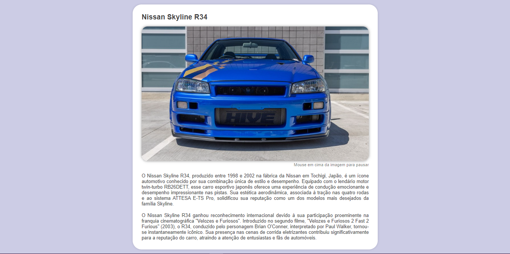

<h2>Um pouco sobre o nissan skyline R34 em uma pagina html de treino</h2>

Nesta página explorei um pouco minhas habilidades de <strong>CSS</strong>, incorporando "@Keyframes" para fazer um slide de fotos do carro.

A pagina é bem simples, nada de mais. Seu único objetivo realmente era o slide.

